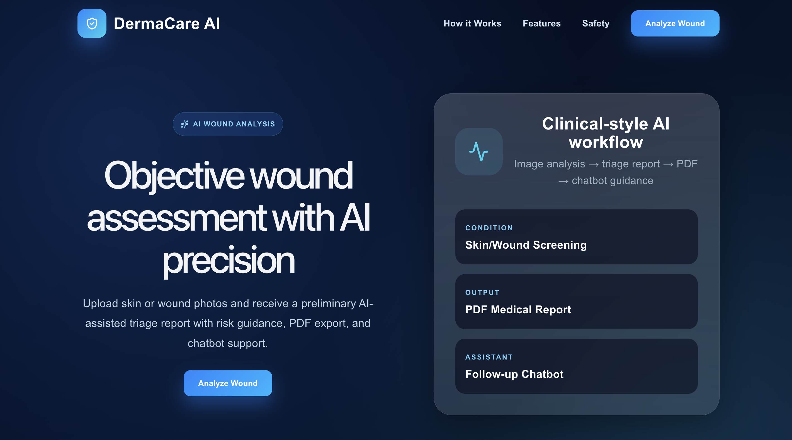
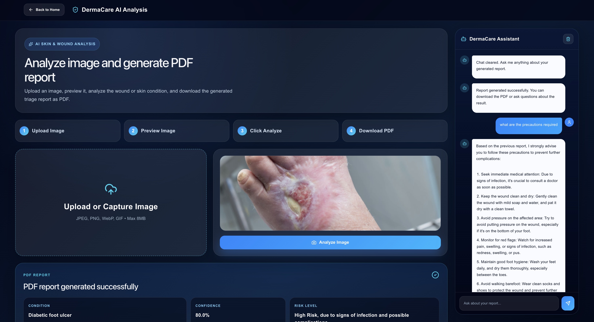
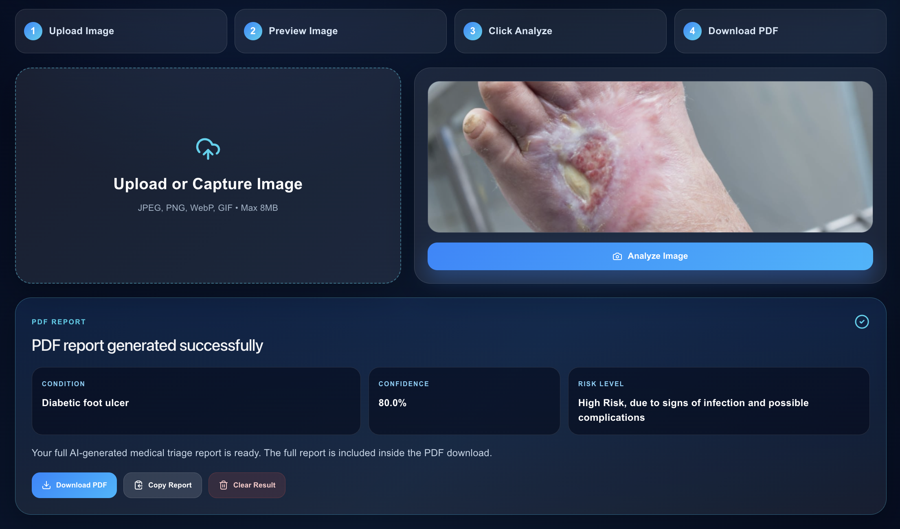

# DermaCare AI

## AI-Powered Skin & Wound Triage Web Application

DermaCare AI is an advanced AI-powered medical triage platform that analyzes skin and wound images using Groq Vision API and Groq LLM API. The application generates preliminary condition predictions, risk analysis, AI-generated medical reports, downloadable PDFs, and chatbot-based follow-up guidance.

---

# Live Demo

## Website

https://dermacare-ai.vercel.app

## Backend API

https://dermacare-ai-8g05.onrender.com

---

# Features

- AI-based skin and wound image analysis
- Preliminary medical triage prediction
- Risk-level assessment system
- AI-generated clinical-style reports
- PDF medical report download
- Interactive medical chatbot assistant
- Modern responsive healthcare UI
- Real-time image upload and preview
- Confidence score generation
- Safety-focused medical disclaimer system

---

# Tech Stack

## Frontend

- React.js
- Vite
- CSS3
- Lucide React Icons
- jsPDF

## Backend

- FastAPI
- Python
- Groq Vision API
- Groq LLM API
- Pillow
- Uvicorn
- Python-dotenv

## Deployment

- Frontend: Vercel
- Backend: Render

---

# System Workflow

1. Upload a skin or wound image
2. Groq vision model analyzes the image
3. AI predicts possible visual findings
4. Risk level and confidence are calculated
5. AI-generated triage report is created
6. PDF report becomes downloadable
7. Chatbot answers follow-up questions safely

---

# Project Architecture

```text
Frontend (React + Vite)
        ↓
FastAPI Backend
        ↓
Groq Vision Analysis
        ↓
Groq LLM Report Generation
        ↓
PDF + Chatbot Output
```

---

# Screenshots

## Landing Page



Modern healthcare-style landing page with AI workflow overview and responsive UI.

---

## Analysis Dashboard



Image upload, real-time preview, AI analysis pipeline, PDF generation, and chatbot guidance dashboard.

---

## Generated AI Medical Report



AI-generated triage report showing predicted condition, confidence score, risk assessment, and downloadable PDF support.

---

# Installation Guide

## Clone Repository

```bash
git clone https://github.com/Nandan0201-debug/dermacare-ai.git
cd dermacare-ai
```

---

# Frontend Setup

```bash
cd frontend
npm install
npm run dev
```

Frontend runs on:

```text
http://localhost:5173
```

---

# Backend Setup

```bash
cd backend
pip install -r requirements.txt
uvicorn main:app --reload
```

Backend runs on:

```text
http://127.0.0.1:8000
```

---

# Environment Variables

Create a `.env` file inside backend folder.

```env
GROQ_API_KEY=your_api_key_here
```

---

# API Endpoints

## Health Check

```http
GET /
```

Returns backend running status.

---

## Analyze Image

```http
POST /analyze
```

Uploads image and generates AI triage report.

---

## Chat Assistant

```http
POST /chat
```

Handles follow-up chatbot interactions.

---

# Project Structure

```text
dermacare-ai/
│
├── backend/
│   ├── main.py
│   ├── requirements.txt
│   ├── runtime.txt
│   └── .env
│
├── frontend/
│   ├── src/
│   │   ├── App.jsx
│   │   ├── App.css
│   │   └── main.jsx
│   ├── package.json
│   └── vite.config.js
│
├── screenshots/
│   ├── landing-page.png
│   ├── analysis-dashboard.png
│   └── medical-report.png
│
├── README.md
└── .gitignore
```

---

# Future Improvements

- Live webcam analysis
- Real-time doctor consultation
- Voice-enabled AI assistant
- Cloud database integration
- Medical history tracking
- Multi-language support
- AI wound healing tracking
- User authentication
- Report history dashboard

---

# Medical Disclaimer

This project provides AI-assisted preliminary guidance only and is not a replacement for professional medical diagnosis or treatment. Users should always consult a licensed healthcare professional for medical concerns.

---

# Author

## Jothisk Nandan Palla

GitHub: https://github.com/Nandan0201-debug

LinkedIn: https://linkedin.com/in/palla-jothisk-nandan

---

# License

This project is developed for educational, research, and portfolio purposes.